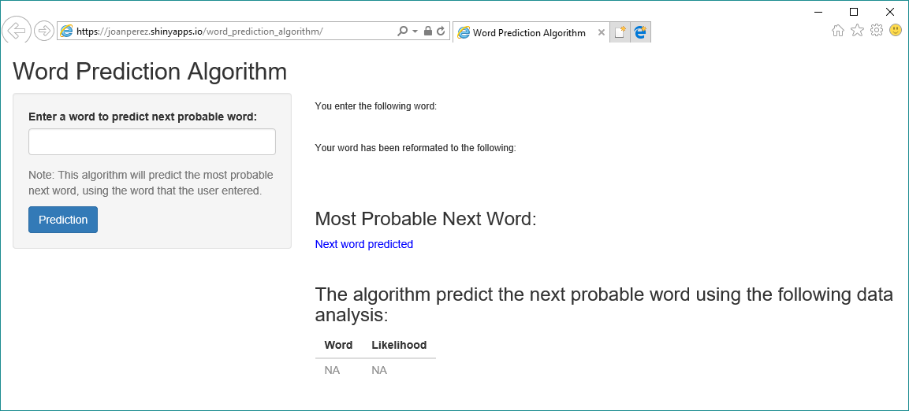

**Author: Joan Manuel Perez**
**Date: 8/31/2017**

Word Prediction Algorithm Scope
========================================================

**Word Prediction Algorithm** is an input technology used where one word represents many words. The **Word Prediction Algorith** could allow for predict the next probable word. Predictive word makes efficient use of fewer device keys to input writing into a text message, an e-mail, an address book, a calendar, and the like.

**Advantages:**

* Better spelling and grammar
* Faster writing
* Improve composition writing

Word Prediction Algorithm Interface
========================================================

**Word Prediction Algorithm** allows the User to enter a word. After press the "Prediction", the **Word Prediction Algorithm** will display selected word before and after processing. 

Then, **Word Prediction Algorithm** will provide the most probable word in blue text and a list of possible alternatives.

Word Prediction Algorithm Functionality
========================================================

* **Word Prediction Algorithm** uses the [HC Corpora][1] dataset to analysis the word probabilities and predict the next probable word.

* The [HC Corpora][1] dataset was normalized to organize the attributes relations of the data, in order to reduce data redundancy and improve data integrity.  Then was categorized into the most frequent word combinations using N-grams.

* Using these N-gram capabilities, the **Word Prediction Algorithm*** use the word submitted and predict the most probable next word and a list of additional alternatives with the probability.

[1]: http://www.corpora.heliohost.org/ "HC Corpora"

References
========================================================

Word Prediction Algorithm code and addtional information [Github][1]

Word Prediction Algorithm Application [Word Prediction Algorithm][2]

The source [HC Corpora][3] data set and associated [About][4].

[1]: https://github.com/joanperez/capstoneproject "Github"
[2]: https://joanperez.shinyapps.io/word_prediction_algorithm/ "Word Prediction Algorithm"
[3]: http://www.corpora.heliohost.org/ "HC Corpora"
[4]: http://www.corpora.heliohost.org/aboutcorpus.html "About"

